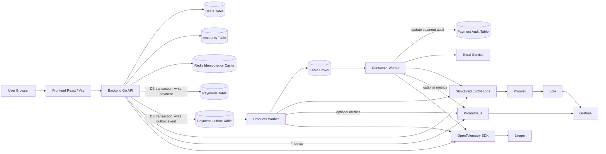
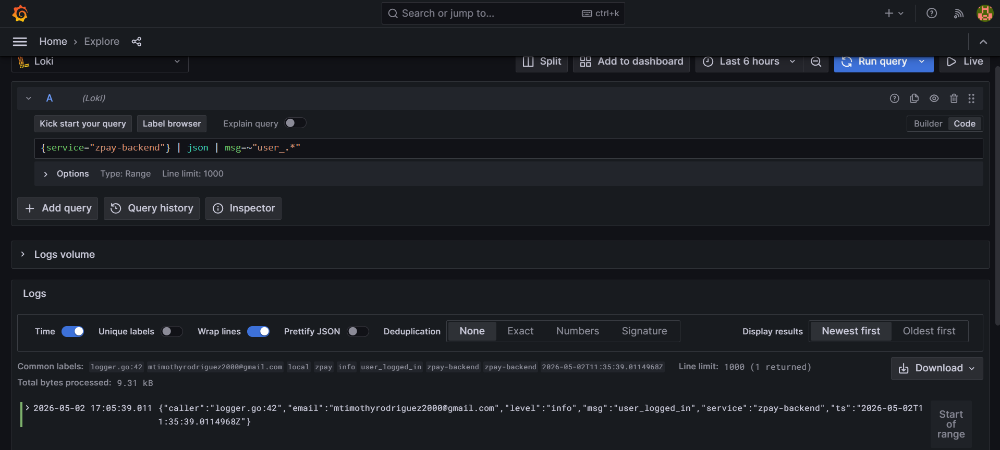
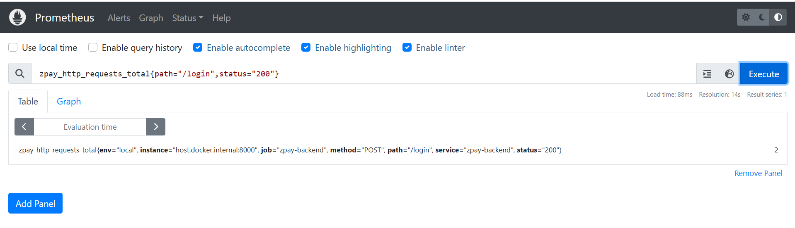
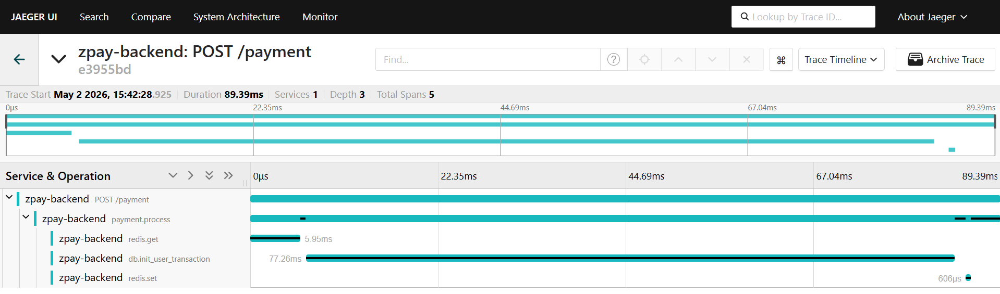

# ZPay

ZPay is a simple fintech application built to demonstrate practical backend design patterns and observability techniques in a payment workflow.

It includes:

- a React frontend for authentication, balance lookup, and payments
- a Go backend API for business logic and transaction processing
- Redis-based idempotency for safe payment retries
- the transactional outbox pattern for reliable event publishing
- Kafka producer and consumer workers for asynchronous processing
- an audit trail and email notification flow
- observability with Loki, Prometheus, Grafana, OpenTelemetry, and Jaeger

## Project Overview

This project is intentionally designed around backend reliability and operational best practices rather than only CRUD features.

Key patterns used:

- **Idempotency**: duplicate payment requests are safely handled through Redis
- **Transactional Outbox**: payment state and event creation happen in the same database transaction
- **Asynchronous Processing**: Kafka decouples core payment flow from downstream side effects
- **Auditability**: consumer workers write audit records after event processing
- **Observability**: logs, metrics, and traces are available for debugging and monitoring

## High-Level Architecture



## Request and Event Flow

### Synchronous payment path

1. The frontend sends a payment request to the backend.
2. The backend checks Redis for the idempotency key.
3. If the request is new, the backend performs the payment write and outbox write in the same database transaction.
4. The backend returns the payment result immediately to the client.

### Asynchronous event path

1. The producer worker polls pending outbox records.
2. The producer publishes the event to Kafka.
3. The consumer worker processes the Kafka event.
4. The consumer updates the audit table and sends email notifications.

This split keeps the user-facing request fast while still allowing reliable downstream processing.

## Core Components

### Frontend

- React + Vite
- handles signup, login, dashboard, balance, and payment UI

### Backend API

- Go + Gin
- handles authentication, balances, transactions, metrics, and tracing

### PostgreSQL tables

- `users`
- `accounts`
- `payments`
- `payment_outbox`
- `payment_audit`

### Redis

- stores idempotency keys and replayable payment results

### Producer Worker

- polls pending outbox records
- publishes payment events to Kafka
- marks outbox rows as published

### Consumer Worker

- consumes Kafka messages
- writes payment audit records
- sends transaction email notifications
- marks processing as complete

### Observability

- **Loki** for logs
- **Prometheus** for metrics
- **Jaeger** for traces
- **Grafana** for visualization

## Local Development Setup

The easiest local setup is: infrastructure in Docker, application processes locally.

### 1. Start infrastructure

Open a terminal in the backend directory:

```powershell
cd backend
docker compose up -d
```

This starts infrastructure services such as:

- PostgreSQL
- Redis
- Kafka
- Kafka UI
- pgAdmin
- Loki
- Promtail
- Grafana
- Prometheus
- Jaeger

Useful URLs:

- Kafka UI: `http://localhost:8080`
- pgAdmin: `http://localhost:5050`
- Grafana: `http://localhost:3000`
- Prometheus: `http://localhost:9090`
- Jaeger: `http://localhost:16686`
- Loki API: `http://localhost:3100`

### 2. Start the frontend

Open a new terminal:

```powershell
cd frontend
npm install
npm run dev
```

The frontend should start on the Vite dev server, typically:

- `http://localhost:5173`

### 3. Start the backend API

Open another terminal:

```powershell
cd backend
go run .\cmd\main.go
```

The backend should start on:

- `http://localhost:8000`

Important endpoints:

- API root: `http://localhost:8000/`
- Prometheus metrics: `http://localhost:8000/metrics`

### 4. Start the producer worker

Open another terminal:

```powershell
cd backend
go run .\cmd\producer\main.go
```

This worker polls the outbox table and publishes events to Kafka.

### 5. Start the consumer worker

Open another terminal:

```powershell
cd backend
go run .\cmd\consumer\main.go
```

This worker consumes Kafka events, updates the audit table, and sends email notifications.

## Development Workflow

Typical local workflow:

1. Start Docker infrastructure with `docker compose up -d`
2. Start the backend API
3. Start the producer worker
4. Start the consumer worker
5. Start the frontend
6. Trigger signup, login, and payment flows from the frontend or an API client
7. Inspect logs, metrics, and traces in Grafana, Prometheus, and Jaeger

## Observability Endpoints

### Logs

- Loki datasource configured in Grafana
- example query:

```logql
{service="zpay-backend"} | json | msg=~"user_.*"
```


### Metrics

- Prometheus UI: `http://localhost:9090`
- Backend metrics endpoint: `http://localhost:8000/metrics`
- Example PromQL:
```promql
sum by (path) (rate(zpay_http_requests_total[5m]))
```


### Traces

- Jaeger UI: `http://localhost:16686`
- service to search: `zpay-backend`



## Example Prometheus Metrics

The backend exposes metrics such as:

- `zpay_http_requests_total`
- `zpay_http_request_duration_seconds`
- `zpay_http_in_flight_requests`
- `zpay_transactions_total`

## Example Loki Query

```logql
{job="zpay"} | json | msg="payment_success"
```

## Example Jaeger Trace Targets

Once tracing is enabled and requests are sent, useful operations to inspect include:

- `POST /signup`
- `POST /login`
- `POST /payment`

## Project Goals

This project is useful for learning and demonstrating:

- backend reliability patterns
- payment workflow design
- idempotent API behavior
- transactional outbox design
- asynchronous event processing with Kafka
- logs, metrics, and traces in a single system
